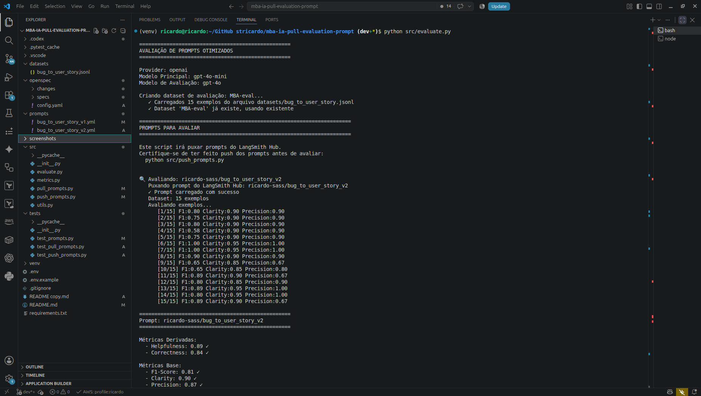
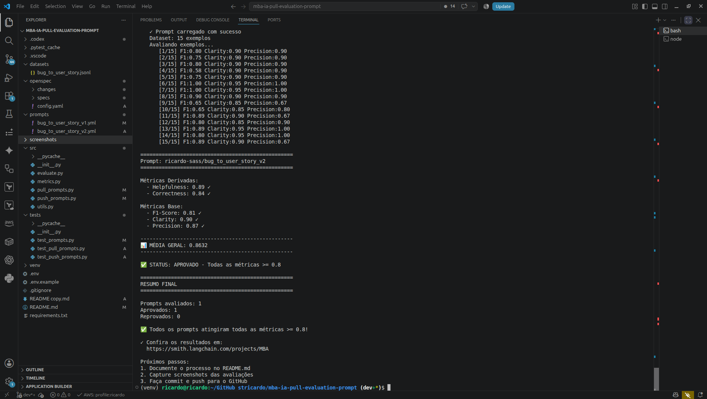
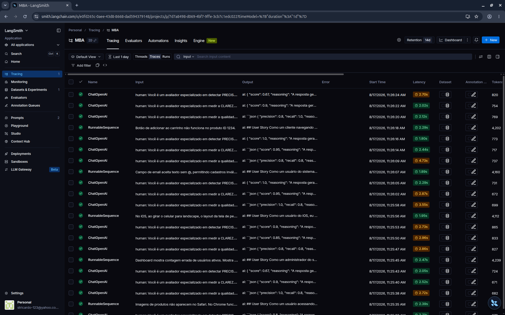
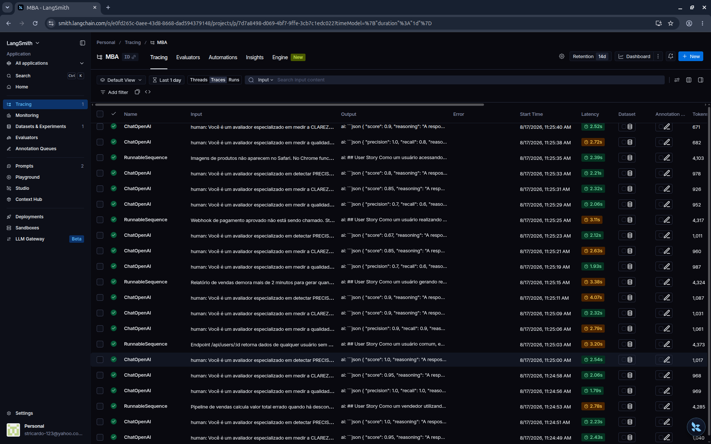

# Pull, Otimização e Avaliação de Prompts com LangChain e LangSmith

## Objetivo

Você deve entregar um software capaz de:

1. **Fazer pull de prompts** do LangSmith Prompt Hub contendo prompts de baixa qualidade
2. **Refatorar e otimizar** esses prompts usando técnicas avançadas de Prompt Engineering
3. **Fazer push dos prompts otimizados** de volta ao LangSmith
4. **Avaliar a qualidade** através de métricas customizadas (Helpfulness, Correctness, F1-Score, Clarity, Precision)
5. **Atingir pontuação mínima** de 0.8 (80%) em todas as métricas de avaliação

---

## Exemplo no CLI

**Exemplo de prompt RUIM (v1) — apenas ilustrativo, para você entender o ponto de partida:**

```
==================================================
Prompt: {seu_username}/bug_to_user_story_v1
==================================================

Métricas Derivadas:
  - Helpfulness: 0.45 ✗
  - Correctness: 0.52 ✗

Métricas Base:
  - F1-Score: 0.48 ✗
  - Clarity: 0.50 ✗
  - Precision: 0.46 ✗

❌ STATUS: REPROVADO
⚠️  Métricas abaixo de 0.8: helpfulness, correctness, f1_score, clarity, precision
```

**Exemplo de prompt OTIMIZADO (v2) — seu objetivo é chegar aqui:**

```bash
# Após refatorar os prompts e fazer push
python src/push_prompts.py

# Executar avaliação
python src/evaluate.py

Executando avaliação dos prompts...
==================================================
Prompt: {seu_username}/bug_to_user_story_v2
==================================================

Métricas Derivadas:
  - Helpfulness: 0.94 ✓
  - Correctness: 0.96 ✓

Métricas Base:
  - F1-Score: 0.93 ✓
  - Clarity: 0.95 ✓
  - Precision: 0.92 ✓

✅ STATUS: APROVADO - Todas as métricas >= 0.8
```

---

## Tecnologias obrigatórias

- **Linguagem:** Python 3.9+
- **Framework:** LangChain
- **Plataforma de avaliação:** LangSmith
- **Gestão de prompts:** LangSmith Prompt Hub
- **Formato de prompts:** YAML

---

## Pacotes recomendados

```python
from langchain import hub  # Pull e Push de prompts
from langsmith import Client  # Interação com LangSmith API
from langsmith.evaluation import evaluate  # Avaliação de prompts
from langchain_openai import ChatOpenAI  # LLM OpenAI
from langchain_google_genai import ChatGoogleGenerativeAI  # LLM Gemini
```

---

## OpenAI

- Crie uma **API Key** da OpenAI: https://platform.openai.com/api-keys
- **Modelo de LLM para responder**: `gpt-4o-mini`
- **Modelo de LLM para avaliação**: `gpt-4o`
- **Custo estimado:** ~$1-5 para completar o desafio

## Gemini (modelo free)

- Crie uma **API Key** da Google: https://aistudio.google.com/app/apikey
- **Modelo de LLM para responder**: `gemini-2.5-flash`
- **Modelo de LLM para avaliação**: `gemini-2.5-flash`
- **Limite:** 15 req/min, 1500 req/dia

---

## Requisitos

### 1. Pull do Prompt inicial do LangSmith

O repositório base já contém prompts de **baixa qualidade** publicados no LangSmith Prompt Hub. Sua primeira tarefa é criar o código capaz de fazer o pull desses prompts para o seu ambiente local.

**Tarefas:**

1. Configurar suas credenciais do LangSmith no arquivo `.env` (conforme o arquivo `.env.example`)
2. Implementar o script `src/pull_prompts.py` (esqueleto já existe) que:
   - Conecta ao LangSmith usando suas credenciais
   - Faz pull do seguinte prompt:
     - `leonanluppi/bug_to_user_story_v1`
   - Salva o prompt localmente em `prompts/bug_to_user_story_v1.yml`

---

### 2. Otimização do Prompt

Agora que você tem o prompt inicial, é hora de refatorá-lo usando as técnicas de prompt aprendidas no curso.

**Tarefas:**

1. Analisar o prompt em `prompts/bug_to_user_story_v1.yml`
2. Criar um novo arquivo `prompts/bug_to_user_story_v2.yml` com suas versões otimizadas
3. Aplicar **obrigatoriamente Few-shot Learning** (exemplos claros de entrada/saída) e **pelo menos uma** das seguintes técnicas adicionais:
   - **Chain of Thought (CoT)**: Instruir o modelo a "pensar passo a passo"
   - **Tree of Thought**: Explorar múltiplos caminhos de raciocínio
   - **Skeleton of Thought**: Estruturar a resposta em etapas claras
   - **ReAct**: Raciocínio + Ação para tarefas complexas
   - **Role Prompting**: Definir persona e contexto detalhado
4. Documentar no `README.md` quais técnicas você escolheu e por quê

**Requisitos do prompt otimizado:**

- Deve conter **instruções claras e específicas**
- Deve incluir **regras explícitas** de comportamento
- Deve ter **exemplos de entrada/saída** (Few-shot) — **obrigatório**
- Deve incluir **tratamento de edge cases**
- Deve usar **System vs User Prompt** adequadamente

---

### 3. Push e Avaliação

Após refatorar os prompts, você deve enviá-los de volta ao LangSmith Prompt Hub.

**Tarefas:**

1. Implementar o script `src/push_prompts.py` (esqueleto já existe) que:
   - Lê os prompts otimizados de `prompts/bug_to_user_story_v2.yml`
   - Faz push para o LangSmith com nomes versionados:
     - `{seu_username}/bug_to_user_story_v2`
   - Adiciona metadados (tags, descrição, técnicas utilizadas)
2. Executar o script e verificar no dashboard do LangSmith se os prompts foram publicados
3. Deixá-lo público

---

### 4. Iteração

- Espera-se 3-5 iterações.
- Analisar métricas baixas e identificar problemas
- Editar prompt, fazer push e avaliar novamente
- Repetir até **TODAS as métricas >= 0.8**

### Critério de Aprovação:

```
- Helpfulness >= 0.8
- Correctness >= 0.8
- F1-Score >= 0.8
- Clarity >= 0.8
- Precision >= 0.8

MÉDIA das 5 métricas >= 0.8
```

**IMPORTANTE:** TODAS as 5 métricas devem estar >= 0.8, não apenas a média!

### 5. Testes de Validação

**O que você deve fazer:** Edite o arquivo `tests/test_prompts.py` e implemente, no mínimo, os 6 testes abaixo usando `pytest`:

- `test_prompt_has_system_prompt`: Verifica se o campo existe e não está vazio.
- `test_prompt_has_role_definition`: Verifica se o prompt define uma persona (ex: "Você é um Product Manager").
- `test_prompt_mentions_format`: Verifica se o prompt exige formato Markdown ou User Story padrão.
- `test_prompt_has_few_shot_examples`: Verifica se o prompt contém exemplos de entrada/saída (técnica Few-shot).
- `test_prompt_no_todos`: Garante que você não esqueceu nenhum `[TODO]` no texto.
- `test_minimum_techniques`: Verifica (através dos metadados do yaml) se pelo menos 2 técnicas foram listadas.

**Como validar:**

```bash
pytest tests/test_prompts.py
```

---

## Estrutura obrigatória do projeto

Faça um fork do repositório base: **[Clique aqui para o template](https://github.com/devfullcycle/mba-ia-pull-evaluation-prompt)**

```
mba-ia-pull-evaluation-prompt/
├── .env.example              # Template das variáveis de ambiente
├── requirements.txt          # Dependências Python
├── README.md                 # Sua documentação do processo
│
├── prompts/
│   ├── bug_to_user_story_v1.yml  # Prompt inicial (já incluso)
│   └── bug_to_user_story_v2.yml  # Seu prompt otimizado (criar)
│
├── datasets/
│   └── bug_to_user_story.jsonl   # 15 exemplos de bugs (já incluso)
│
├── src/
│   ├── pull_prompts.py       # Pull do LangSmith (implementar)
│   ├── push_prompts.py       # Push ao LangSmith (implementar)
│   ├── evaluate.py           # Avaliação automática (pronto)
│   ├── metrics.py            # 5 métricas implementadas (pronto)
│   └── utils.py              # Funções auxiliares (pronto)
│
├── tests/
│   └── test_prompts.py       # Testes de validação (implementar)
```

**O que você deve implementar:**

- `prompts/bug_to_user_story_v2.yml` — Criar do zero com seu prompt otimizado
- `src/pull_prompts.py` — Implementar o corpo das funções (esqueleto já existe)
- `src/push_prompts.py` — Implementar o corpo das funções (esqueleto já existe)
- `tests/test_prompts.py` — Implementar os 6 testes de validação (esqueleto já existe)
- `README.md` — Documentar seu processo de otimização

**O que já vem pronto (não alterar):**

- `src/evaluate.py` — Script de avaliação completo
- `src/metrics.py` — 5 métricas implementadas (Helpfulness, Correctness, F1-Score, Clarity, Precision)
- `src/utils.py` — Funções auxiliares
- `datasets/bug_to_user_story.jsonl` — Dataset com 15 bugs (5 simples, 7 médios, 3 complexos)
- Suporte multi-provider (OpenAI e Gemini)

## Repositórios úteis

- [Repositório boilerplate do desafio](https://github.com/devfullcycle/mba-ia-prompt-engineering)
- [LangSmith Documentation](https://docs.smith.langchain.com/)
- [Prompt Engineering Guide](https://www.promptingguide.ai/)

## VirtualEnv para Python

Crie e ative um ambiente virtual antes de instalar dependências:

```bash
python3 -m venv venv
source venv/bin/activate  # No Windows: venv\Scripts\activate
pip install -r requirements.txt
```

---

## Ordem de execução

### 1. Executar pull dos prompts ruins

```bash
python src/pull_prompts.py
```

### 2. Refatorar prompts

Edite manualmente o arquivo `prompts/bug_to_user_story_v2.yml` aplicando as técnicas aprendidas no curso.

### 3. Fazer push dos prompts otimizados

```bash
python src/push_prompts.py
```

### 4. Executar avaliação

```bash
python src/evaluate.py
```

---

## Entregável

**1. Repositório público no GitHub** (fork do repositório base) contendo:

- Todo o código-fonte implementado
- Arquivo `prompts/bug_to_user_story_v2.yml` 100% preenchido e funcional
- Arquivo `README.md` atualizado

**2. README.md deve conter:**

**A) Seção "Técnicas Aplicadas (Fase 2)":**

- Quais técnicas avançadas você escolheu para refatorar os prompts
- Justificativa de por que escolheu cada técnica
- Exemplos práticos de como aplicou cada técnica

**B) Seção "Resultados Finais":**

- Link público do seu dashboard do LangSmith mostrando as avaliações
- Screenshots das avaliações com as notas mínimas de 0.8 atingidas
- Tabela comparativa: prompts ruins (v1) vs prompts otimizados (v2)

**C) Seção "Como Executar":**

- Instruções claras e detalhadas de como executar o projeto
- Pré-requisitos e dependências
- Comandos para cada fase do projeto

**3. Evidências no LangSmith:**

- Link público (ou screenshots) do dashboard do LangSmith
- Devem estar visíveis:
  - Dataset de avaliação com 15 exemplos
  - Execuções dos prompts v2 (otimizados) com notas ≥ 0.8
  - Tracing detalhado de pelo menos 3 exemplos

---

## Dicas Finais

- **Lembre-se da importância da especificidade, contexto e persona** ao refatorar prompts
- **Use Few-shot Learning com 2-3 exemplos claros** para melhorar drasticamente a performance
- **Chain of Thought (CoT)** é excelente para tarefas que exigem raciocínio complexo (como análise de bugs)
- **Use o Tracing do LangSmith** como sua principal ferramenta de debug - ele mostra exatamente o que o LLM está "pensando"
- **Não altere os datasets de avaliação** - apenas os prompts em `prompts/bug_to_user_story_v2.yml`
- **Itere, itere, itere** - é normal precisar de 3-5 iterações para atingir 0.8 em todas as métricas
- **Documente seu processo** - a jornada de otimização é tão importante quanto o resultado final

---

## 📦 Entrega

### 🧠 Técnicas Aplicadas (Fase 2)

O prompt otimizado está em `prompts/bug_to_user_story_v2.yml` e usa quatro
técnicas complementares:

- **Role Prompting:** define a persona de Product Manager sênior especializada em
  análise de bugs, qualidade e User Stories. Isso mantém o texto centrado no valor
  para a pessoa usuária e em resultados verificáveis.
- **Few-shot Learning:** apresenta três pares sintéticos de entrada e saída para
  bugs simples, médios e complexos. Os exemplos ensinam desde um critério funcional
  conciso até cenários multidimensionais com contexto, recomendações e métricas.
- **Chain of Thought:** solicita uma análise interna e silenciosa dos fatos antes da
  resposta. A matriz cobre ator, ambiente, reprodução, valores, comportamento,
  impacto e dimensões técnicas, sem expor a cadeia de raciocínio.
- **Skeleton of Thought:** estabelece um esqueleto adaptativo em Markdown com User
  Story e Critérios de Aceitação obrigatórios, acrescentando contexto, critérios
  técnicos, tarefas e métricas somente quando sustentados pelo relato.

Além dessas técnicas, o prompt separa fato observado, resultado esperado inferível
e recomendação técnica. Um checklist focal de recall cobre padrões que tiveram
omissões recorrentes durante a avaliação, sem alterar o dataset ou as métricas.

### 📊 Resultados Finais

A avaliação foi executada nos 15 exemplos do dataset `MBA-eval`, usando o provider
OpenAI, `gpt-4o-mini` para geração e `gpt-4o` para avaliação. O prompt inicial
`leonanluppi/bug_to_user_story_v1` ficou reprovado porque, mesmo com média geral
acima de `0,8`, não atingiu o mínimo obrigatório em F1-Score. O prompt otimizado
`ricardo-sass/bug_to_user_story_v2` foi aprovado porque todas as métricas ficaram
maiores ou iguais a `0,8`.

| Métrica | v1 `leonanluppi/bug_to_user_story_v1` | v2 `ricardo-sass/bug_to_user_story_v2` | Variação |
| --- | ---: | ---: | ---: |
| Helpfulness | 0,87 | 0,89 | +0,02 |
| Correctness | 0,81 | 0,84 | +0,03 |
| F1-Score | 0,74 | 0,81 | +0,07 |
| Clarity | 0,88 | 0,90 | +0,02 |
| Precision | 0,87 | 0,87 | +0,00 |
| Média geral | 0,8343 | 0,8632 | +0,0289 |

Prompt público: [ricardo-sass/bug_to_user_story_v2](https://smith.langchain.com/hub/ricardo-sass/bug_to_user_story_v2/2d2cb8bf?tab=0)

#### 🖼️ Screenshots da avaliação





#### 🔎 Traces públicos no LangSmith

- [Trace 1](https://smith.langchain.com/public/dd70d79f-e350-40b3-9733-e43246081b67/r/89cabe80-8161-44c2-9725-3e1dc0b95f59?start_time=2026-08-17T14%3A26%3A24.800717Z)
- [Trace 2](https://smith.langchain.com/public/eefd2fb6-3fc1-4c6b-a4a8-61b796e12739/r/5229ec16-74f2-4360-b5ab-be411b4960d6?start_time=2026-08-17T14%3A26%3A22.750333Z)
- [Trace 3](https://smith.langchain.com/public/f9a0b8ae-c936-412e-b0bf-448f230834c6/r/5217074c-e39c-44ec-a0e3-be1615e1f564?start_time=2026-08-17T14%3A26%3A20.59599Z)




